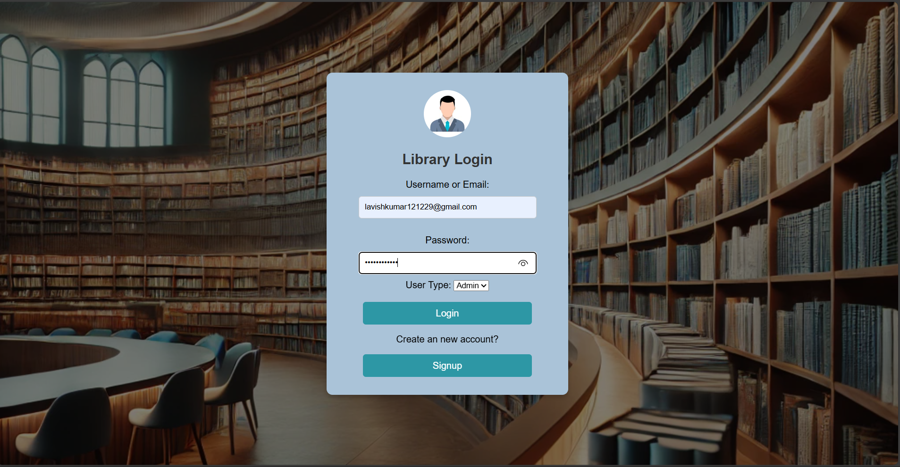
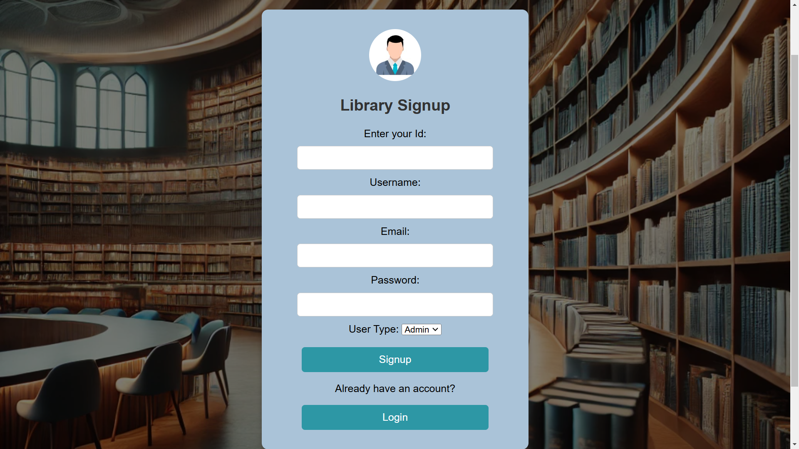
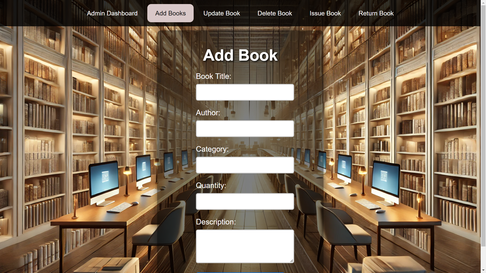
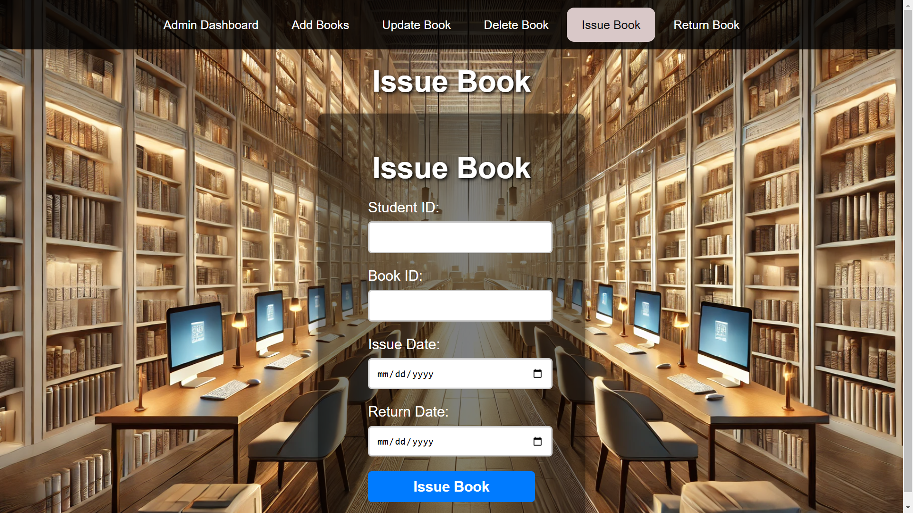
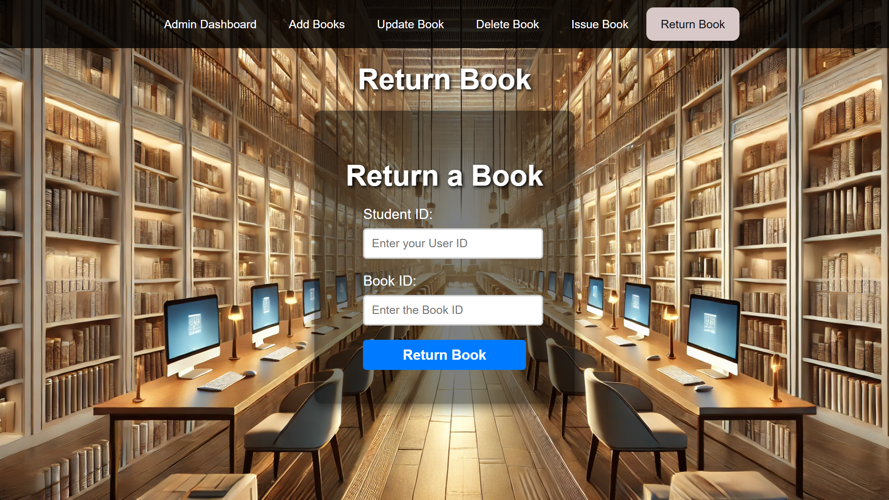
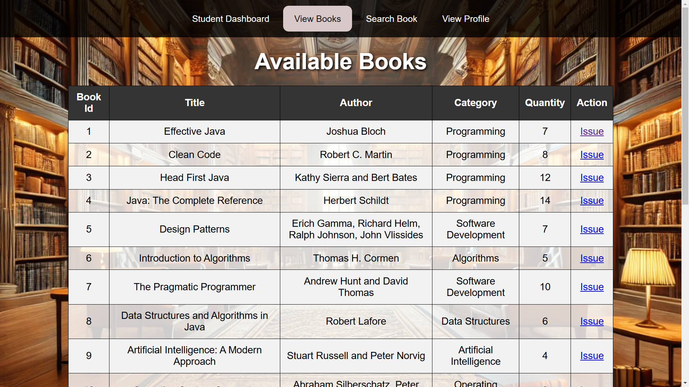
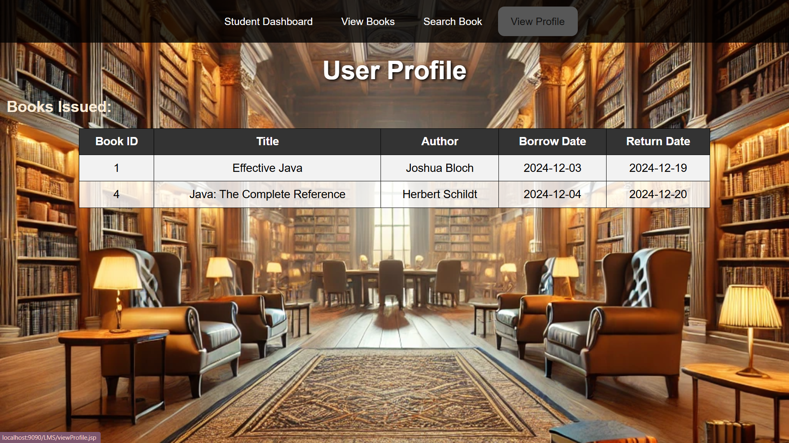

# Library Management System

## Project Overview
The Library Management System is a web-based application developed using **Java (JSP, Servlets)**, **Tomcat Server**, **MySQL Database**, **HTML**, and **CSS**. It facilitates managing library operations such as book management, user authentication, and book borrowing.

---

## Features
### Admin Features
- Add, update, search, and delete book records.
- Issue and return books.
- Manage user records.

### Student Features
- Search for books by title, author, or category.
- View available books.

---

## Technology Stack
- **Frontend:** HTML, CSS, JSP
- **Backend:** Java Servlets
- **Database:** MySQL
- **Server:** Apache Tomcat

---

## Database Setup
### MySQL Queries
```sql
CREATE DATABASE LibraryDB;

USE LibraryDB;

CREATE TABLE users (
    id INT AUTO_INCREMENT PRIMARY KEY,
    username VARCHAR(50) NOT NULL,
    email VARCHAR(100) NOT NULL UNIQUE,
    password VARCHAR(255) NOT NULL
);

CREATE TABLE books (
    id INT AUTO_INCREMENT PRIMARY KEY,
    title VARCHAR(255) NOT NULL,
    author VARCHAR(100),
    category VARCHAR(50),
    is_available BOOLEAN DEFAULT TRUE
);

CREATE TABLE borrowed_books (
    id INT AUTO_INCREMENT PRIMARY KEY,
    user_id INT,
    book_id INT,
    borrow_date DATE,
    return_date DATE,
    FOREIGN KEY (user_id) REFERENCES users(id),
    FOREIGN KEY (book_id) REFERENCES books(id)
);
```

---

## Installation Guide

### Step 1: Clone the Repository
```bash
git clone https://github.com/lavish-0027/Libarary-management-system

### Step 2: Import Project
- Open the project in an IDE like **Eclipse** or **IntelliJ IDEA**.

### Step 3: Configure Database
- Import the provided SQL script to MySQL.

### Step 4: Configure Tomcat Server
- Deploy the project on **Apache Tomcat Server**.

### Step 5: Run the Project
- Access the application via `http://localhost:9090/library-management-system`.

---

## Project Snapshots

### **Login Page**


### **SignUp Page**


### **Admin Dashboard**


### **Admin Dashboard**


### **Admin Dashboard Feature**

| Add Book Page              | Update Book Page        | Delete Book Page        |
|------------------------|-------------------------|------------------------|
|  |  |  |

| Issue Book Page              | Return Book Page       | 
|------------------------|-------------------------|
|  |  |


### **Student Dashboard Feature**
| View Books              | Search Books       | View Profile        |
|------------------------|-------------------------|------------------------|
|  |  |  |

### **Logout Page**


---

## Contributions
Contributions are welcome! Please fork this repository, create a new branch, and submit a pull request.

---

## Maintainer
- **Name:** Lavish Kumar 
- **Email:** lavishkumar121229@gmail.co

